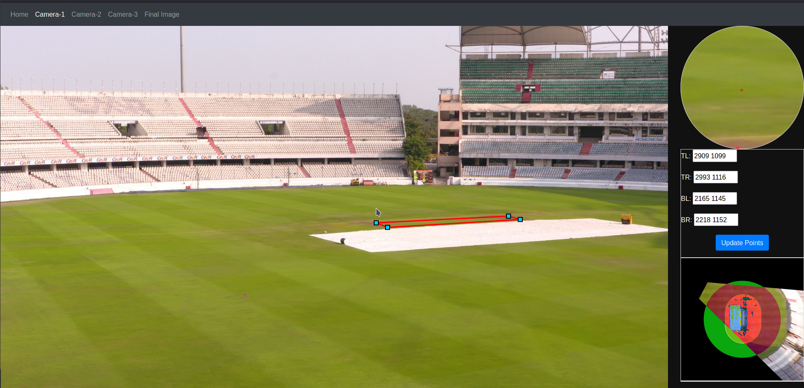

# Visual Tracking in Cricket

Tracking position of all players in a cricket field from top view by calibrating available camera views.

https://raw.githubusercontent.com/dhruvarya/visual-tracking-cricket/main/screenshots/annotation.mp4

## Running
	> $ cd src/
	> $ pip install -r requirements.txt
	> $ python3 app.py 
App will start running on localhost:4000

## Testing
	> $ cd src/
	> $ python3 test.py
